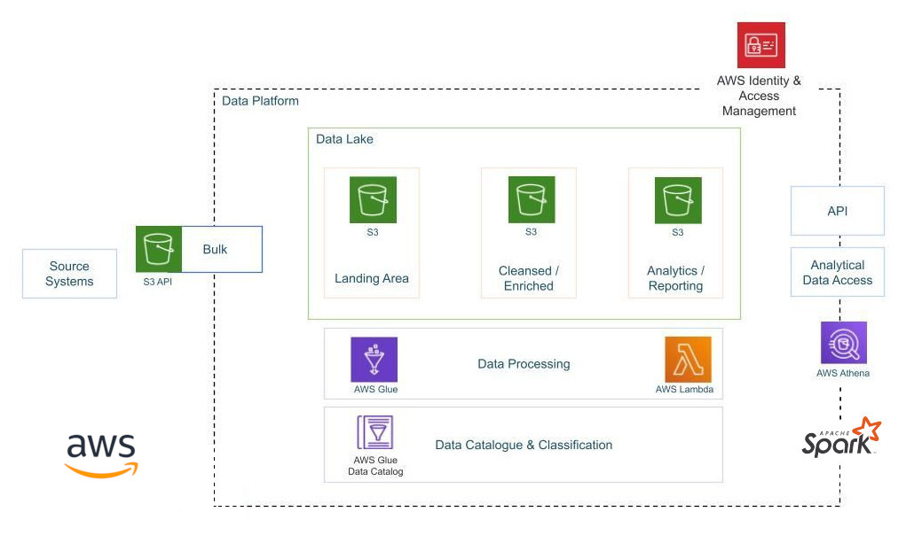

  

# Data Engineering YouTube Project

Bu proje, video kategorilerine ve trend olan metriklere dayalı olarak yapılandırılmış ve yarı yapılandırılmış YouTube videoları verilerini güvenli bir şekilde yönetmeyi, kolaylaştırmayı ve analiz etmeyi amaçlar. **Proje içeriği şunlardır:**

* Veri Alımı: Farklı kaynaklardan veri almak için bir mekanizma oluşturulacak. Bu kaynaklar, YouTube API'si veya diğer veri sağlayıcıları olabilir.

* ETL Sistemi: Alınan veriler ham formatta olacaktır. Bu veriler, uygun formata dönüştürülerek temizlenir ve gerektiğinde ölçeklendirilir.

* Veri Deposu: Birden çok kaynaktan alınan verilerin depolanması için merkezi bir veri gölüne ihtiyaç vardır. Bu amaçla Amazon S3 gibi bir nesne depolama hizmeti kullanılabilir.

* Ölçeklenebilirlik: Veri boyutu arttıkça sistem de ölçeklendirilebilmelidir. Bulut tabanlı hizmetler, veri işleme ve depolama gereksinimlerini karşılamak için ölçeklenebilirlik sağlayabilir.

* Raporlama: Verilerin analiz edilmesi ve raporlanması için bir pano veya görselleştirme aracı kullanılabilir.

**Proje için kullanılan hizmetler:**

* [Amazon S3](/command-aws-s3/): Bu hizmet, projedeki verileri depolamak için kullanılır. S3, geniş ölçekte veri depolama gereksinimlerini karşılayabilen güvenli ve ölçeklenebilir bir nesne depolama çözümüdür.

* AWS IAM: IAM (Identity and Access Management), AWS hizmetlerine erişimi güvenli bir şekilde yönetmenizi sağlar. Bu hizmetle kullanıcılar, roller ve izinler tanımlayarak projenizdeki kaynaklara kontrollü erişim sağlayabilirsiniz.

* [AWS Glue](/aws-glue/): AWS Glue, veri entegrasyonu, veri hazırlama ve veri birleştirme işlemlerini kolaylaştıran bir sunucusuz veri tümleştirme hizmetidir. verileri farklı kaynaklardan alabilir, dönüştürebilir ve hedef veri formatlarına uygun hale getirebilir.

* [AWS Lambda](/lambda-function/): Lambda, sunucu yönetimi olmadan kod çalıştırmayı sağlayan bir hizmettir. Örneğin, veri işleme, analiz veya dönüşüm gibi işlemleri otomatikleştirmek veya planlamak için Lambda fonksiyonları kullanılabilir.

* [AWS Athena](/amazon-athena/): Athena, S3 üzerinde depolanan verilere etkileşimli SQL sorguları yapmanızı sağlayan bir hizmettir. Verileri önceden yüklemeden, verilerin yapılandırılmış veya yarı yapılandırılmış olmasına bakılmaksızın sorgulayabilirsiniz. Bu şekilde, büyük veri kümeleri üzerinde hızlı ve kolay veri analizi yapabilirsiniz.

**Kullanılan Kaynaklar :**

* [link1](https://www.youtube.com/watch?v=yZKJFKu49Dk&feature=youtu.be)
* [link2](https://docs.aws.amazon.com/)
* [link3](https://www.youtube.com/watch?v=vQ-ozzingLA)
* [link4](https://aws.amazon.com/athena/getting-started/)

