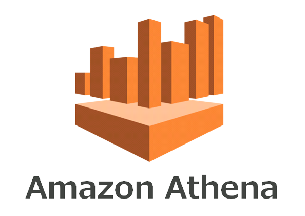

[**Amazon Athena**](https://aws.amazon.com/tr/athena/), açık tablo ve dosya biçimlerini destekleyen, açık kaynak çerçeveler üzerinde oluşturulmuş, sunucusuz ve etkileşimli bir analiz hizmetidir. Athena, petabaytlarca veriyi bulunduğu yerde analiz etmenin basit ve esnek bir yolunu sunar. Amazon Basit Depolama Hizmeti (S3) veri gölü ve şirket içi veri kaynakları veya diğer bulut sistemleri dahil olmak üzere 25'ten fazla veri kaynağından verileri SQL ya da Python kullanarak analiz edin veya uygulamalar oluşturun. Athena, hiçbir tedarik veya yapılandırma işlemi gerektirmeden açık kaynak Trino ve Presto altyapıları ve Apache Spark çerçeveleri üzerinde oluşturulmuştur.

