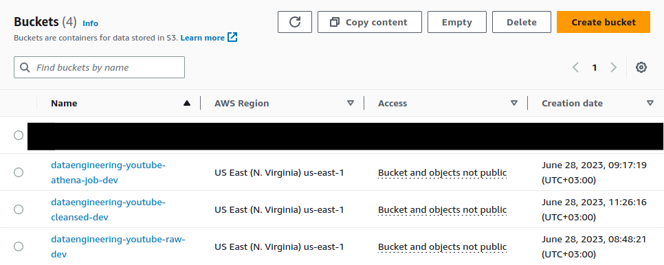
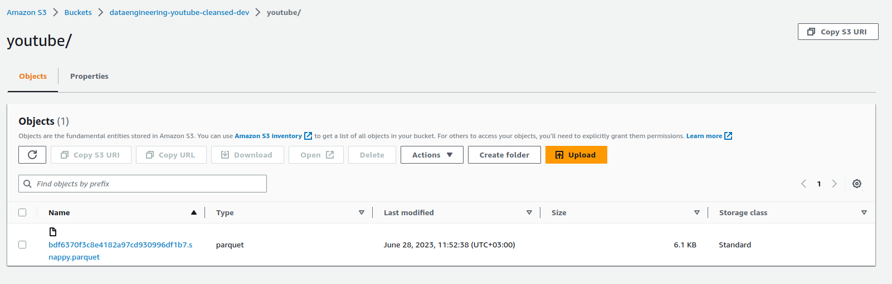

[**Amazon Basit Depolama Hizmeti (Amazon S3)**](https://aws.amazon.com/tr/s3/); sektör lideri ölçeklenebilirlik, veri erişilebilirliği, güvenlik ve performans sunan bir nesne depolama hizmetidir. Her büyüklükteki ve her sektörden müşteriler istedikleri miktarda veriyi veri gölleri, bulut temelli ve mobil uygulamalar gibi neredeyse her türlü kullanım örneği için depolayıp koruyabilir. Uygun maliyetli depolama sınıfları ve kullanımı kolay yönetim özellikleri sayesinde maliyetlerinizi optimize edebilir, verilerinizi düzenleyebilir ve hassas ayarlanmış erişim denetimlerini belirli iş, kuruluş ve uygunluk gereksinimlerini karşılayacak şekilde yapılandırabilirsiniz. 


```bash
# aws s3 cp
aws s3 cp . s3://dataengineering-youtube-raw-dev/youtube/raw_statistics_reference_data/ --recursive --exclude "*" --include "*.json"


aws s3 cp CAvideos.csv s3://dataengineering-youtube-raw-dev/youtube/raw_statistics/region=ca/

aws s3 cp DEvideos.csv s3://dataengineering-youtube-raw-dev/youtube/raw_statistics/region=de/

aws s3 cp FRvideos.csv s3://dataengineering-youtube-raw-dev/youtube/raw_statistics/region=fr/

aws s3 cp GBvideos.csv s3://dataengineering-youtube-raw-dev/youtube/raw_statistics/region=gb/

aws s3 cp INvideos.csv s3://dataengineering-youtube-raw-dev/youtube/raw_statistics/region=in/

aws s3 cp JPvideos.csv s3://dataengineering-youtube-raw-dev/youtube/raw_statistics/region=jp/

aws s3 cp KRvideos.csv s3://dataengineering-youtube-raw-dev/youtube/raw_statistics/region=kr/

aws s3 cp MXvideos.csv s3://dataengineering-youtube-raw-dev/youtube/raw_statistics/region=mx/

aws s3 cp RUvideos.csv s3://dataengineering-youtube-raw-dev/youtube/raw_statistics/region=ru/

aws s3 cp USvideos.csv s3://dataengineering-youtube-raw-dev/youtube/raw_statistics/region=us//
```





